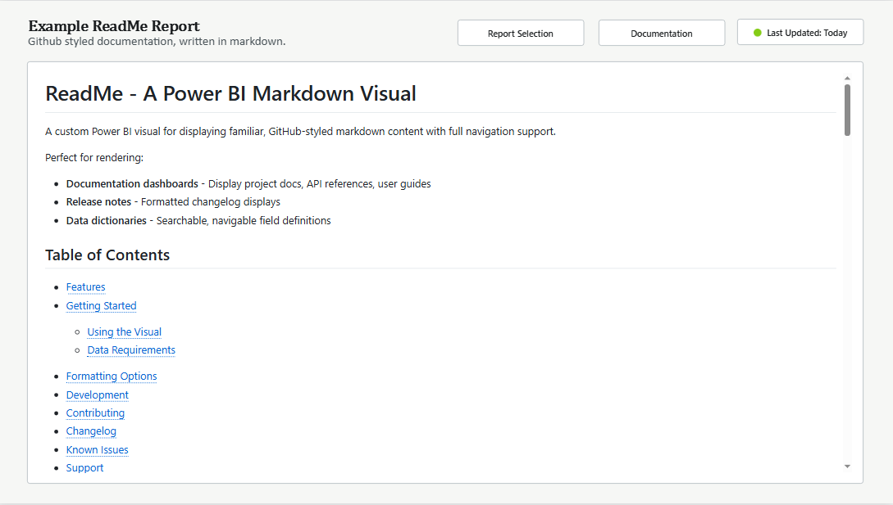

# ReadMe - A Power BI Markdown Visual

A custom Power BI visual for displaying familiar, GitHub-styled markdown content with full navigation support. Perfect for creating documentation dashboards, formatted release notes, and searchable data dictionaries in your Power BI reports.



Current .pbiviz and example .pbix available [**here**](https://github.com/MDeanLindsay/PBI-README/tree/main/README/dist).

## Table of Contents
- [Table of Contents](#table-of-contents)
- [Features](#features)
- [Getting Started](#getting-started)
  - [Using the Visual](#using-the-visual)
  - [Data Requirements](#data-requirements)
- [Formatting Options](#formatting-options)
- [Development](#development)
- [Contributing](#contributing)
- [Changelog](#changelog)
- [Known Issues](#known-issues)
- [Support](#support)
- [License](#license)

## Features

- **GitHub-Style Formatting**: Uses authentic GitHub markdown CSS
- **Responsive Design**: Adapts to different visual sizes in Power BI reports
- **Full Markdown Support**: 
  - Headers, linked indexes, lists, tables, code blocks
  - Links, images, blockquotes

## Getting Started

### Using the Visual

1. **Import the Visual**: Install the `.pbiviz` file in your Power BI report
2. **Add Data**: Connect your markdown text data source
3. **Map Fields**: Drag your markdown text field to the "Markdown Text" data role
4. **Customize**: Use the formatting pane to adjust appearance

### Data Requirements

The visual expects a single text field containing valid markdown. (No, you can't use measures. Put it in a table.)

```markdown
# My Report

## Table of Contents
* [Overview](#overview)
* [Key Metrics](#key-metrics)
* [Conclusions](#conclusions)

## Overview
This report shows...

## Key Metrics
- Metric 1: 95%
- Metric 2: $1.2M
- Metric 3: 15% increase

## Conclusions
Based on our analysis...
```

## Formatting Options

Access these settings in Power BI's formatting pane:

| Setting | Description | Default |
|---------|-------------|---------|
| Font Size | Base font size, scales titles accordingly | 16px |
| Padding | Internal spacing | 8px |
| Background Color | Visual background color | Transparent |
| Font Family | Choose from 8 font options | System Default |

## Development

### Prerequisites

- Node.js (v18+)
- Power BI Visual Tools: `npm install -g powerbi-visuals-tools`

### Dependencies

- **marked** (^15.0.12) - Markdown parsing
- **github-markdown-css** (^5.8.1) - GitHub-style formatting
- **dompurify** (^3.2.6) - XSS protection
- **d3** (7.9.0) - Data visualization utilities
- **powerbi-visuals-api** (~5.11.0) - Power BI integration
- **powerbi-visuals-utils-formattingmodel** (6.1.1) - Formatting utilities
- **powerbi-visuals-utils-interactivityutils** (^6.0.4) - Interaction utilities
- **powerbi-visuals-utils-tooltiputils** (^6.0.4) - Tooltip utilities

### Setup

```bash
# Clone the repository
git clone https://github.com/MDeanLindsay/PBI-README.git

cd PBI-README/README

# Install dependencies
npm install
```

### Development

```bash
# Start development server
npm run start
# or
pbiviz start
```


### Build for Production

```bash
# Create .pbiviz package
npm run package
# or 
npm pbiviz package
```

### Project Structure

```
README/
├── src/
│   ├── visual.ts          # Main visual logic
│   └── settings.ts        # Formatting settings
├── style/
│   └── visual.less        # CSS styling
├── capabilities.json      # Visual capabilities
├── pbiviz.json           # Visual metadata
├── package.json          # Dependencies
├── tsconfig.json         # TypeScript configuration
└── eslint.config.mjs     # ESLint configuration
```

## Contributing

1. Fork the repository
2. Create a feature branch: `git checkout -b feature/new-feature`
3. Commit changes: `git commit -m 'Add feature'`
4. Push to branch: `git push origin feature/new-feature`
5. Open a pull request

## Changelog

### v1.0.0.0
- Initial release

## Known Issues

- Internal links require exact header text matching
- Some advanced markdown features may not render identically to GitHub

## Support

For questions, issues, or feature requests:
1. Check existing [GitHub issues](https://github.com/mdeanlindsay/PBI-README/issues)
2. Create a new issue with detailed description
3. Include markdown sample and expected vs actual behavior

## License

MIT License

### Third-Party Licenses

This project includes:
- `github-markdown-css` (MIT) - Copyright (c) Sindre Sorhus
- `marked` (MIT) - Copyright (c) 2011-2018, Christopher Jeffrey
- `dompurify` (Apache-2.0 OR MPL-2.0) - Copyright (c) Cure53

---

**Made for those who hate native Power BI text tools.** 